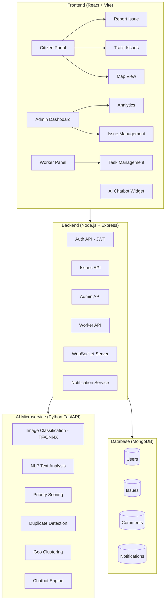

# Smarteye – Smart Civic Issue Reporting & Management System

## Overview

Build a production-ready, full-stack smart city platform that enables citizens to report civic issues (potholes, garbage, water leaks, broken streetlights, etc.), with AI-powered auto-classification, priority scoring, duplicate detection, and real-time tracking. Includes admin analytics dashboard, worker task management, and an AI chatbot.

---

## Architecture



---

## User Review Required

> [!IMPORTANT]
> **MongoDB**: MongoDB is not installed locally. The app will be configured to connect to **MongoDB Atlas** (free tier). You'll need to provide a connection string, OR I can set up a fallback using **NeDB** (file-based MongoDB-compatible) for fully offline local development.

> [!IMPORTANT]
> **AI Models**: For image classification, I'll use a **pre-trained MobileNet/ONNX** model bundled with the Python service (no GPU required). For NLP/chatbot, I'll use **simulated AI responses** with a clean interface so you can plug in OpenAI API key later.

> [!WARNING]
> **API Keys**: The following are optional but enhance the experience:
> - **OpenAI API Key** – for advanced chatbot & NLP (will work without it using rule-based fallback)
> - **Cloudinary** – for image hosting (will use local file storage as fallback)
> - **Google Maps API Key** – will use **Leaflet + OpenStreetMap** (free, no key needed) as default

---

## Proposed Changes

### 1. Project Structure

```
c:\Users\hegde\Desktop\Smarteye\
├── frontend/                    # React + Vite + TailwindCSS
│   ├── src/
│   │   ├── components/          # Reusable UI components
│   │   ├── pages/               # Page components
│   │   ├── context/             # React Context (Auth, Theme)
│   │   ├── hooks/               # Custom hooks
│   │   ├── services/            # API service layer
│   │   ├── utils/               # Utilities
│   │   └── assets/              # Static assets
│   ├── public/
│   ├── index.html
│   ├── vite.config.js
│   ├── tailwind.config.js
│   └── package.json
│
├── backend/                     # Node.js + Express
│   ├── src/
│   │   ├── config/              # DB, env config
│   │   ├── middleware/           # Auth, validation, error handling
│   │   ├── models/              # Mongoose schemas
│   │   ├── routes/              # API routes
│   │   ├── controllers/         # Route handlers
│   │   ├── services/            # Business logic
│   │   ├── utils/               # Helpers
│   │   └── websocket/           # WebSocket setup
│   ├── uploads/                 # Local file uploads
│   ├── server.js
│   └── package.json
│
├── ai-service/                  # Python FastAPI
│   ├── app/
│   │   ├── models/              # ML model files
│   │   ├── routes/              # API endpoints
│   │   ├── services/            # AI logic
│   │   └── utils/               # Helpers
│   ├── requirements.txt
│   └── main.py
│
├── .env.example
├── docker-compose.yml           # Optional containerization
└── README.md
```

---

### 2. Frontend (React + Vite + TailwindCSS)

#### [NEW] `frontend/` — Complete React Application

**Pages:**
| Page | Route | Role | Description |
|------|-------|------|-------------|
| Landing | `/` | Public | Hero, stats, CTA to report |
| Login/Register | `/auth` | Public | JWT auth with role selection |
| Report Issue | `/report` | Citizen | Multi-step form with image/voice/GPS |
| My Issues | `/my-issues` | Citizen | Track submitted complaints |
| Map View | `/map` | All | Interactive Leaflet map with markers & heatmap |
| Issue Detail | `/issue/:id` | All | Full issue view with comments, upvotes |
| Admin Dashboard | `/admin` | Admin | Analytics, charts, management tables |
| Admin Issues | `/admin/issues` | Admin | Full issue management with filters |
| Worker Panel | `/worker` | Worker | Assigned tasks, status updates |
| Chatbot | Widget | All | Floating AI chatbot |

**Key Components:**
- `Navbar` – Role-aware navigation with glassmorphism
- `IssueCard` – Rich card with status badge, severity, category icon
- `MapView` – Leaflet map with marker clusters, heatmap layer
- `ReportForm` – Multi-step wizard (description → image → location → review)
- `VoiceInput` – Web Speech API integration
- `ChatbotWidget` – Floating chat interface
- `AnalyticsCharts` – Chart.js dashboards (trends, department performance)
- `StatusTimeline` – Visual progress tracker
- `ImageUploader` – Drag & drop with preview
- `NotificationBell` – Real-time notification dropdown

**Design System:**
- Dark mode by default with light mode toggle
- Glassmorphism cards with backdrop-blur
- Vibrant gradient accents (blue-purple-cyan palette)
- Smooth micro-animations and transitions
- Google Font: Inter
- Fully mobile responsive

---

### 3. Backend (Node.js + Express)

#### [NEW] `backend/` — REST API + WebSocket Server

**Database Schemas (MongoDB/Mongoose):**

```
User {
  name, email, password(hashed), role(citizen/admin/worker),
  phone, avatar, points, department, createdAt
}

Issue {
  title, description, category, severity, priorityScore(0-100),
  status(submitted/in-progress/resolved/escalated),
  images[], location{lat, lng, address},
  reportedBy(User), assignedTo(User), department,
  upvotes[], duplicateOf(Issue),
  aiAnalysis{category, confidence, severity, duplicateScore},
  slaDeadline, resolvedAt, resolutionProof[],
  createdAt, updatedAt
}

Comment {
  issueId, userId, text, createdAt
}

Notification {
  userId, type, message, issueId, read, createdAt
}
```

**API Endpoints:**

| Method | Endpoint | Description |
|--------|----------|-------------|
| POST | `/api/auth/register` | Register user |
| POST | `/api/auth/login` | Login, returns JWT |
| GET | `/api/auth/me` | Get current user |
| POST | `/api/issues` | Create issue (with file upload) |
| GET | `/api/issues` | List issues (with filters, pagination) |
| GET | `/api/issues/:id` | Get single issue |
| PATCH | `/api/issues/:id/status` | Update status |
| POST | `/api/issues/:id/upvote` | Toggle upvote |
| POST | `/api/issues/:id/comments` | Add comment |
| GET | `/api/issues/:id/comments` | Get comments |
| GET | `/api/admin/analytics` | Dashboard analytics |
| GET | `/api/admin/issues` | Admin issue list |
| PATCH | `/api/admin/issues/:id/assign` | Assign to worker |
| GET | `/api/worker/tasks` | Worker's assigned tasks |
| PATCH | `/api/worker/tasks/:id/resolve` | Mark resolved with proof |
| GET | `/api/notifications` | User notifications |
| POST | `/api/chatbot` | Proxy to AI chatbot |

**Features:**
- JWT authentication with bcrypt password hashing
- Role-based middleware (citizen, admin, worker)
- Multer for file uploads (local storage, Cloudinary-ready)
- WebSocket (socket.io) for real-time notifications
- Input validation with express-validator
- Error handling middleware
- Rate limiting
- CORS configured

---

### 4. AI Microservice (Python FastAPI)

#### [NEW] `ai-service/` — AI/ML Processing Engine

**Endpoints:**

| Method | Endpoint | Description |
|--------|----------|-------------|
| POST | `/api/classify-image` | Classify uploaded image |
| POST | `/api/analyze-text` | NLP text analysis |
| POST | `/api/priority-score` | Calculate priority score |
| POST | `/api/check-duplicate` | Check for duplicate issues |
| POST | `/api/cluster-issues` | Geo-spatial clustering |
| POST | `/api/chatbot` | AI chatbot response |

**AI Implementation:**
1. **Image Classification**: Pre-trained model (using ONNX Runtime with a simple CNN trained on civic issue categories). For demo, uses a rule-based classifier augmented with image analysis heuristics.
2. **Text Analysis**: Keyword extraction + category mapping using NLP (spaCy or rule-based). OpenAI-ready interface for upgrade.
3. **Priority Scoring**: Multi-factor algorithm (severity × recency × upvotes × area density × SLA proximity)
4. **Duplicate Detection**: Haversine distance for location + text cosine similarity using TF-IDF
5. **Geo Clustering**: DBSCAN clustering algorithm for nearby issues
6. **Chatbot**: Rule-based with intent matching + OpenAI GPT fallback when API key available

---

### 5. Integration & Real-Time

- **WebSocket**: Socket.io for real-time status updates and notifications
- **Maps**: Leaflet.js + OpenStreetMap (free, no API key needed)
  - Marker clusters for issue density
  - Heatmap layer for area-wise visualization
  - GPS auto-detect for issue reporting
- **Voice Input**: Web Speech API (browser-native, no dependencies)
- **File Upload**: Multer → local storage (Cloudinary-ready interface)

---

## Tech Stack Summary

| Layer | Technology | Purpose |
|-------|-----------|---------|
| Frontend | React 18 + Vite | SPA framework |
| Styling | TailwindCSS 3 | Utility-first CSS |
| State | React Context + useReducer | State management |
| Charts | Chart.js + react-chartjs-2 | Analytics visualization |
| Maps | Leaflet + react-leaflet | Map & heatmap |
| Backend | Express.js | REST API |
| Auth | JWT + bcrypt | Authentication |
| Database | MongoDB + Mongoose | Data storage |
| Real-time | Socket.io | WebSocket |
| AI Service | Python FastAPI | ML processing |
| AI/ML | ONNX Runtime, scikit-learn, spaCy | Classification & NLP |
| Upload | Multer | File handling |

---

## Open Questions

> [!IMPORTANT]
> 1. **MongoDB**: Should I use **MongoDB Atlas** (you'd need a free-tier connection string) or **NeDB** (fully offline file-based DB that's MongoDB-compatible)? I recommend NeDB for easiest local setup.

> [!IMPORTANT]
> 2. **TailwindCSS Version**: You specified TailwindCSS. Should I use **TailwindCSS v3** (stable, widely used) or **v4** (latest)? I recommend v3 for stability.

> [!NOTE]
> 3. **OpenAI API**: Do you have an OpenAI API key for the chatbot, or should I build it fully rule-based with the option to add OpenAI later?

---

## Verification Plan

### Automated Tests
1. Start backend: `npm run dev` — verify all API routes respond
2. Start frontend: `npm run dev` — verify all pages render
3. Start AI service: `uvicorn main:app` — verify classification endpoints
4. Browser testing:
   - Register citizen, admin, worker accounts
   - Submit issue with image + GPS
   - Verify AI classification returns category + priority
   - Check map markers appear
   - Admin views analytics dashboard
   - Worker resolves issue
   - Real-time notification received

### Manual Verification
- Visual inspection of UI (glassmorphism, animations, responsiveness)
- Mobile responsive testing via browser dev tools
- End-to-end workflow: report → classify → assign → resolve → notify
